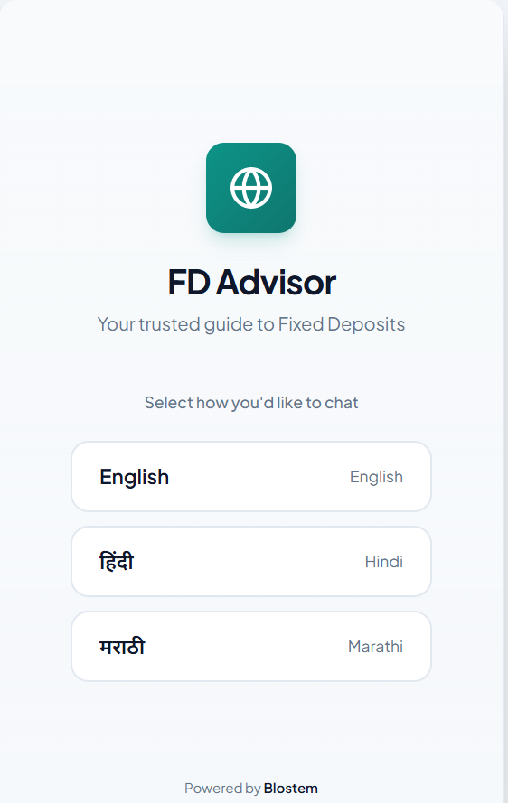
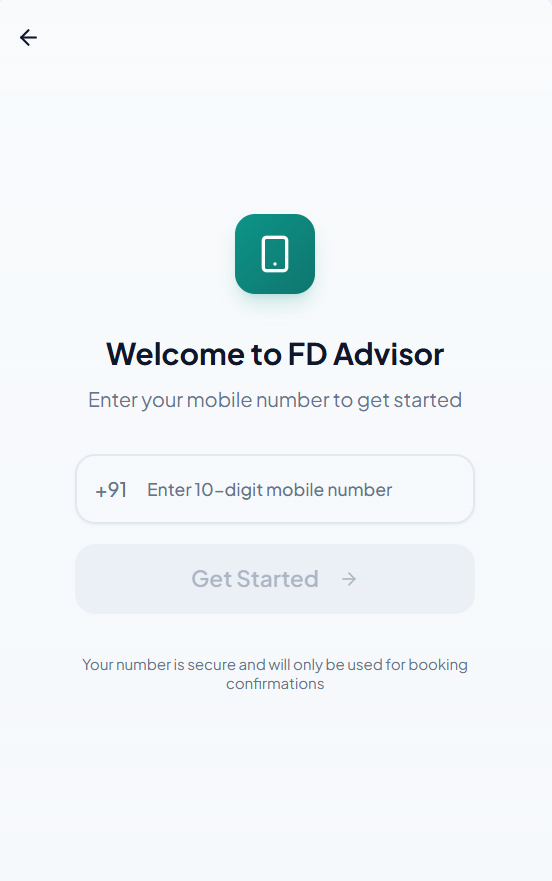
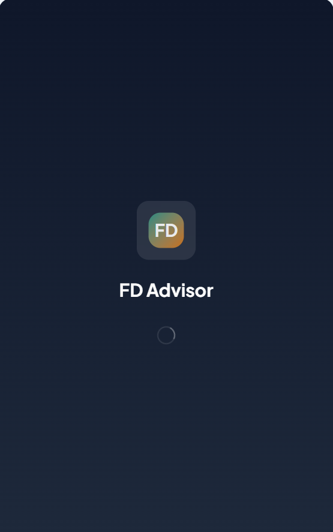
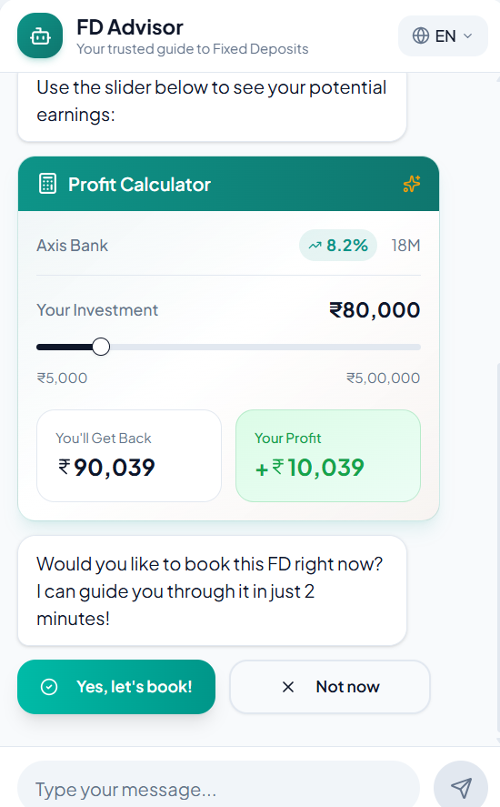
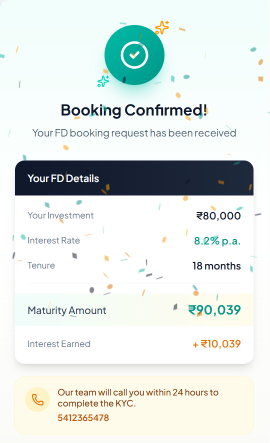

# 🏦 FD Advisor
**An AI-Powered Fixed Deposit Assistant for the Modern Indian User.**

[](https://fd-advisor.vercel.app)
[](https://drive.google.com/file/d/1UfHlUAnBtbJ_9pCQyf_2IbOYck2Vzw4Q/view?usp=sharing)
[](#%EF%B8%8F-tech-stack)

> **Note:** The Express backend is deployed on Render's free tier. We utilize an automated cron-job to prevent server cold starts, ensuring the AI responds instantly when you test the app.

---

## 📖 Overview

Navigating fixed deposits and banking jargon can be overwhelming. FD Advisor is a multilingual, AI-driven lead-generation funnel designed to make financial decisions frictionless. 

Instead of forcing users to manually fill out tedious web forms, the app allows them to simply paste an FD offer they received via SMS or WhatsApp (e.g., *"SBI is offering 7.5% p.a. for 12 months"*). Behind the scenes, Google's **Gemini 2.5 Flash** parses the unstructured text, calculates the returns, translates complex terms into the user's preferred language, and smoothly transitions them into a secure KYC lead-capture flow.

---

## 📸 Product Gallery

1. **Landing & Chat Interface:** 
2. **Multilingual Support (EN/HI/MR):** 
3. **Dynamic Jargon Highlighting:** 
4. **Interactive Profit Calculator:** 
5. **Secure Lead Generation Form:** 

---

## ✨ Core Features

* 🧠 **Intelligent Parsing (Gemini 2.5 Flash):** Extracts precise financial data (Bank Name, Interest Rate, Tenure) directly from natural language using highly constrained JSON-schema system prompts.
* 🌍 **Built for India:** Seamlessly chat, read explanations, and navigate the UI in English, Hindi, and Marathi, powered by `react-i18next`.
* 🔍 **Contextual Jargon Buster:** The AI automatically flags complex financial terms (like *p.a.* or *Tenure*). A custom case-insensitive regex engine highlights these terms dynamically in the chat, making them clickable to reveal simple, bottom-sheet definitions.
* 🧮 **Interactive Maturity Calculator:** A real-time compound interest engine complete with fluid visual sliders so users can explore their potential returns.
* 🛡️ **Verified Lead Capture:** An in-chat KYC form that captures the user's Full Name and PAN. It utilizes strict frontend regex validation (e.g., `ABCDE1234F`) and backend Mongoose schema enforcement before touching the database.
* 💾 **Local Persistence:** Chat history and language preferences are stored locally via `zustand/middleware/persist`, ensuring users never lose their conversational context if they refresh the page.
* 🎨 **Premium UI/UX:** Designed with a clean, modern aesthetic. Built entirely with Tailwind CSS and Framer Motion for buttery-smooth animations and bouncy, responsive chat bubbles.

---

## 🛠️ Tech Stack

| Frontend | Backend | AI & Deployment |
| :--- | :--- | :--- |
| **Next.js** (React) | **Node.js** | **Gemini 2.5 Flash** API |
| **Tailwind CSS** | **Express.js** | **Vercel** (Frontend) |
| **Zustand** (State Persistence) | **MongoDB Atlas** | **Render** (Backend) |
| **Framer Motion** | **Mongoose** ODM | **cron-job.org** (Anti-sleep) |
| **React-i18next** | **CORS & Dotenv** | |

---

## 🏗️ Architecture & Engineering Highlights

* **JSON Prompt Engineering & Sanitization:** Gemini 2.5 Flash is strictly instructed to return data in a predictable JSON schema. To prevent crash loops, the backend middleware automatically strips markdown formatting from the AI's response before parsing the payload.
* **The "Anti-Sleep" Cron Architecture:** To combat serverless free-tier inactivity cycles, an external ping hits the server's `/health` endpoint every 14 minutes. This keeps the Express server perpetually awake, guaranteeing zero-latency AI responses for end users.
* **Robust CORS Policy:** The Express backend is locked down to explicitly accept API requests *only* from the deployed Vercel production domain and the local development environment, rejecting unauthorized cross-origin attempts.

---

## 🚀 Local Development

To run this project locally, ensure you have Node.js (v18+) installed, a MongoDB Atlas cluster, and a valid Google Gemini API key.

### 1. Clone & Install
```bash
git clone [https://github.com/thevaibhavtyagi/fd-advisor.git](https://github.com/thevaibhavtyagi/fd-advisor.git)
cd fd-advisor

### 2. Backend Setup
Open a terminal in the `backend` directory:
```bash
cd backend
npm install
```
Create a `.env` file in the `backend` folder:
```env
PORT=5000
MONGODB_URI=your_mongodb_connection_string
GEMINI_API_KEY=your_google_gemini_api_key
```
Start the server:
```bash
npm start
# Output should confirm: [MongoDB] Connected successfully
```

### 3. Frontend Setup
Open a new terminal in the root `fd-advisor` directory:
```bash
npm install
```
Create a `.env.local` file in the root folder:
```env
NEXT_PUBLIC_API_URL=http://localhost:5000/api
```
Start the development server:
```bash
npm run dev
```
Visit `http://localhost:3000` in your browser.

---

## 👤 Author

Designed and engineered by **Vaibhav Tyagi** for the Blostem Hackathon.

* **Portfolio:** [vaibhavtyagi.me](https://vaibhavtyagi.me)
* **GitHub:** [@thevaibhavtyagi](https://github.com/thevaibhavtyagi)
```